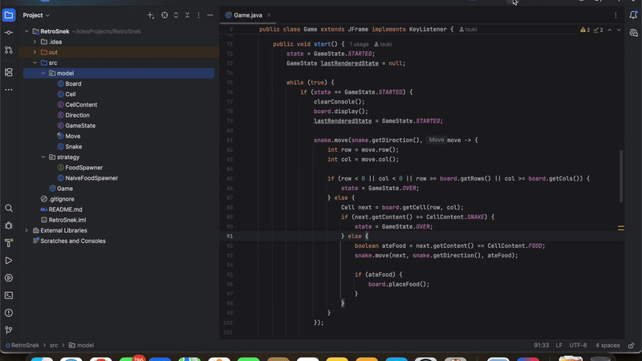
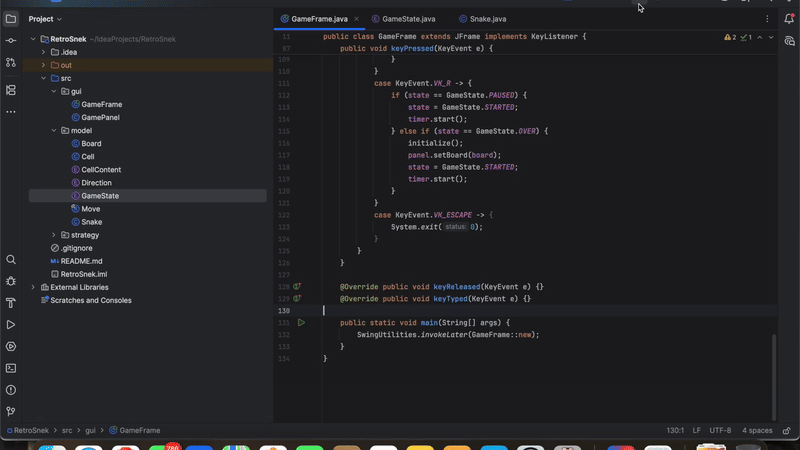

# 🐍 Snake Game in Java

This is a simple implementation of the classic Snake game built entirely in **Java**, just for fun — no external game engines like Unity, Godot, or Unreal used.

## 🎮 Features

* **Two Versions:**
  - CLI version (command-line based, retro vibes)
  - GUI version (built with Java Swing)
* **Smooth Movement:** Keyboard-controlled gameplay
* **Score Tracking:** Keeps count of your growth
* **Zero Dependencies:** No external libraries or engines used

## 🛠️ Setup

#### 1. Clone the repository:
```bash
https://github.com/iTzTalha/RetroSnek
```

#### 2. Compile and run the game:
```console 
cd RetroSnek
javac -d src/*.java
java -cp GameFrame
```

## 🕹️ How to Play

**Controls:**

- `Arrow Keys` - Move the snake (Up, Down, Left, Right)
- `P` - Pause the game
- `R` - Resume or Restart the game after gameover

**Goal:**  
Eat the food, grow longer, and avoid hitting the walls or yourself. The game ends when the snake collides with a wall or its own body.

## 🎥 Demo

**CLI Version (Command Line)**  


**GUI Version (Java Swing)**  


## 🚀 Technologies Used
* **Java:** Core language for implementation.
* **Object-Oriented Design:** Modular and reusable code structure.
* **Design Patterns:** Applied for efficient game mechanics.
* **Java Swing:** for basic GUI

## 📬 Contributing
Contributions to the Splitwise Clone project are welcome! If you find any bugs or have suggestions for improvements, feel free to open an issue or submit a pull request.

## Show Your Support
Give a ⭐️ if you like this project!
